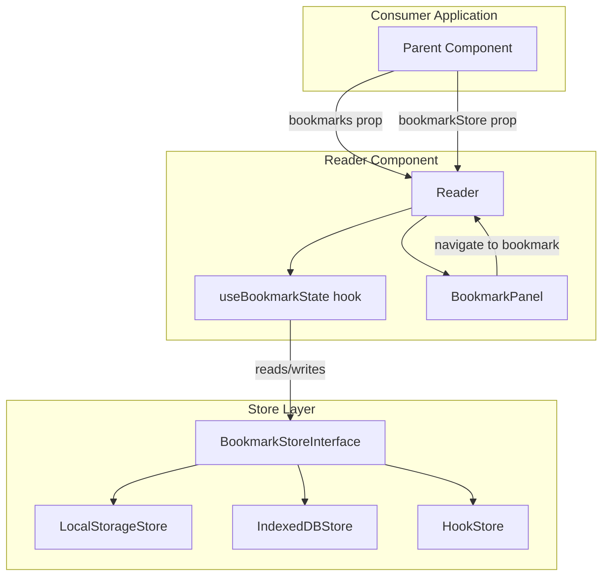
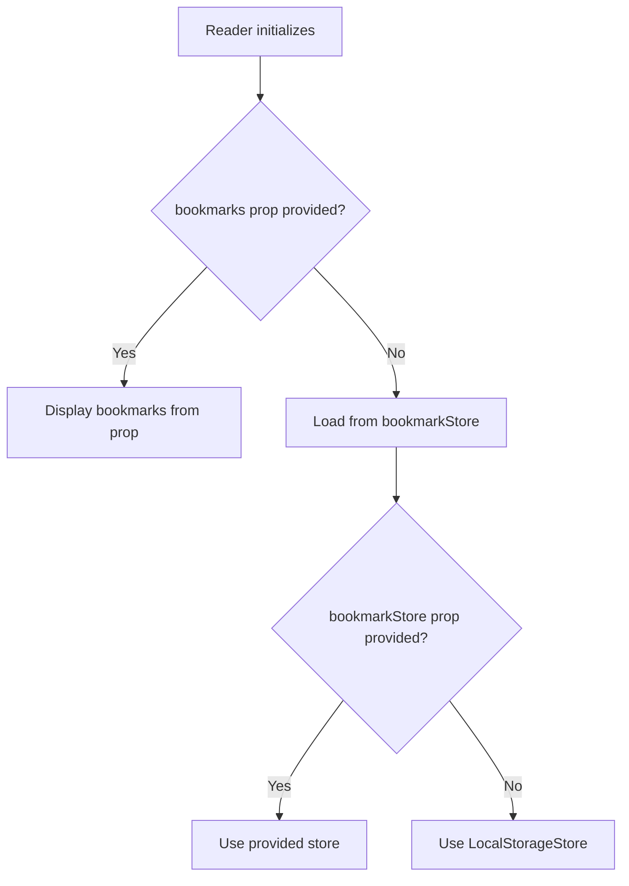

# Design Document: Bookmarks Property

## Overview

This design introduces a pluggable bookmark store architecture for the Qari ebook reader. The system decouples bookmark persistence from the Reader component through a unified `BookmarkStoreInterface`, enabling three interchangeable backends: localStorage (default), IndexedDB (for large collections), and a hook-based adapter (for remote server persistence). The Reader component gains a `bookmarks` prop for externally supplied bookmark state and a `bookmarkStore` prop for store selection. Navigation from the BookmarkPanel to bookmarked positions completes the feature.

### Design Goals

- **Pluggability**: Any store backend conforming to the interface works transparently
- **Prop-driven control**: Parent components can fully own bookmark state via the `bookmarks` prop
- **Backward compatibility**: The existing `bookmarkAdapter` prop and `BookmarkStore` class continue to function; the new `bookmarkStore` prop offers a cleaner API
- **Efficient storage**: IndexedDB store handles large collections without localStorage size limits
- **Remote persistence**: Hook-based store enables server-side storage via user callbacks

## Architecture



### Data Flow

1. **Initialization**: Reader checks if `bookmarks` prop is provided. If yes, uses it directly. If no, loads from the configured `bookmarkStore` (defaulting to LocalStorageStore).
2. **Runtime mutations**: When a user creates/deletes/renames a bookmark:
   - If `bookmarks` prop is provided: fire `onBookmarkChange` callback; do NOT update displayed state (parent owns it)
   - If `bookmarks` prop is NOT provided: persist via store AND update displayed state
3. **Prop reactivity**: When `bookmarks` prop reference changes, displayed state syncs immediately.
4. **Navigation**: BookmarkPanel click → resolve chapter + page from bookmark position → update Reader navigation state.

### Store Precedence



## Components and Interfaces

### BookmarkStoreInterface

The core contract that all store implementations must fulfill. This extends the existing `CustomStoreAdapter` with an `update` method.

```typescript
interface BookmarkStoreInterface {
  save(bookmark: Bookmark): Promise<void>;
  load(bookId: string): Promise<Bookmark[]>;
  list(): Promise<Bookmark[]>;
  remove(bookmarkId: string): Promise<void>;
  update(bookmark: Bookmark): Promise<void>;
}
```

**Design Decision**: We extend `CustomStoreAdapter` rather than replacing it, so existing adapter implementations remain valid. The new `update` method is the only addition. Stores that don't support `update` can implement it as a save-with-replace.

### LocalStorageStore

Default implementation. Stores all bookmarks as a JSON array under a namespaced key.

```typescript
class LocalStorageStore implements BookmarkStoreInterface {
  private readonly keyPrefix: string;
  
  constructor(keyPrefix?: string);
  
  save(bookmark: Bookmark): Promise<void>;
  load(bookId: string): Promise<Bookmark[]>;
  list(): Promise<Bookmark[]>;
  remove(bookmarkId: string): Promise<void>;
  update(bookmark: Bookmark): Promise<void>;
}
```

**Key behaviors**:
- Storage key: `${keyPrefix}bookmarks` (default prefix: `qari-`)
- Per-book limit: 50 bookmarks
- Corrupted JSON treated as empty collection (graceful recovery)
- Quota exceeded / unavailable → rejected Promise with descriptive error

### IndexedDBStore

High-capacity implementation using browser IndexedDB.

```typescript
class IndexedDBStore implements BookmarkStoreInterface {
  private db: IDBDatabase | null;
  private readonly dbName: string;
  private readonly storeName: string;
  
  constructor(dbName?: string);
  
  save(bookmark: Bookmark): Promise<void>;
  load(bookId: string): Promise<Bookmark[]>;
  list(): Promise<Bookmark[]>;
  remove(bookmarkId: string): Promise<void>;
  update(bookmark: Bookmark): Promise<void>;
}
```

**Key behaviors**:
- Object store key path: `id`
- Index on `bookId` for efficient filtered queries
- `save` uses `put` (upsert semantics)
- `remove` on non-existent ID resolves without error
- Connection errors include operation name in error message

### HookStore

Callback-based implementation for remote persistence.

```typescript
interface HookStoreCallbacks {
  onSave?: (bookmark: Bookmark) => Promise<void>;
  onLoad?: (bookId: string) => Promise<Bookmark[]>;
  onList?: () => Promise<Bookmark[]>;
  onRemove?: (bookmarkId: string) => Promise<void>;
  onUpdate?: (bookmark: Bookmark) => Promise<void>;
}

class HookStore implements BookmarkStoreInterface {
  constructor(callbacks: HookStoreCallbacks);
  
  save(bookmark: Bookmark): Promise<void>;
  load(bookId: string): Promise<Bookmark[]>;
  list(): Promise<Bookmark[]>;
  remove(bookmarkId: string): Promise<void>;
  update(bookmark: Bookmark): Promise<void>;
}
```

**Key behaviors**:
- Missing callback for an operation → rejected Promise with "operation not supported"
- Callback errors propagate directly to the caller
- No local caching — every call delegates to the callback

### Updated Reader Props

```typescript
interface ReaderProps {
  // ... existing props ...
  bookmarks?: Bookmark[];
  bookmarkStore?: BookmarkStoreInterface;
  onBookmarkChange?: (event: BookmarkChangeEvent) => void;
}

interface BookmarkChangeEvent {
  type: 'created' | 'deleted' | 'renamed';
  bookmark: Bookmark;
}
```

### Bookmark Navigation (BookmarkPanel → Reader)

When a bookmark is clicked in the BookmarkPanel:

1. Look up `bookmark.chapterId` in `book.chapters`
2. If chapter not found → show error, stay on current page
3. Calculate target page: `Math.floor(bookmark.position / charsPerPage)`
4. If position > chapter char count → navigate to last page
5. Update `currentChapterIdx` and `currentPage` state
6. Fire `onPageChange` callback with new position
7. Recalculate reading progress

## Data Models

### Bookmark (existing, unchanged)

```typescript
interface Bookmark {
  id: string;          // UUID v4
  bookId: string;      // Identifies the book
  chapterId: string;   // Chapter within the book
  position: number;    // Character offset within chapter
  name: string;        // User-provided, 1-100 chars
  createdAt: string;   // ISO 8601 UTC
  updatedAt?: string;  // ISO 8601 UTC, set on rename/update
}
```

### LocalStorage Schema

```
Key: "qari-bookmarks"
Value: JSON array of Bookmark objects
```

### IndexedDB Schema

```
Database: "qari-bookmarks-db"
Object Store: "bookmarks"
  Key Path: "id"
  Indexes:
    - "bookId" (non-unique) → for filtered load queries
```

### State Shape (internal to Reader)

```typescript
// Within ReaderState
interface ReaderState {
  // ... existing fields ...
  bookmarks: Bookmark[];  // Currently displayed bookmark collection
}
```


## Correctness Properties

*A property is a characteristic or behavior that should hold true across all valid executions of a system—essentially, a formal statement about what the system should do. Properties serve as the bridge between human-readable specifications and machine-verifiable correctness guarantees.*

### Property 1: Save/Load Round-Trip

*For any* valid Bookmark object and any conforming BookmarkStoreInterface implementation, saving the bookmark and then calling `load(bookmark.bookId)` SHALL return a collection containing a bookmark with the same id, bookId, chapterId, position, name, and createdAt.

**Validates: Requirements 1.1, 1.5, 2.2, 2.3, 2.7, 3.3, 3.7**

### Property 2: Load Filters by BookId

*For any* set of bookmarks saved across multiple distinct bookIds, calling `load(bookId)` SHALL return only bookmarks whose `bookId` field matches the provided argument, and SHALL return an empty array for any bookId that has no saved bookmarks.

**Validates: Requirements 1.2, 2.4, 3.4**

### Property 3: Remove Then Absent

*For any* bookmark that has been saved to the store, calling `remove(bookmark.id)` and then `load(bookmark.bookId)` SHALL return a collection that does not contain a bookmark with that id.

**Validates: Requirements 1.3, 2.5, 3.5**

### Property 4: Remove Non-Existent Resolves Gracefully

*For any* string identifier that does not correspond to a bookmark in the store (IndexedDB implementation), calling `remove(id)` SHALL resolve the Promise without throwing an error.

**Validates: Requirements 1.4, 3.9**

### Property 5: Update Reflected in Load

*For any* bookmark that exists in the store and any valid updated field values, calling `update(updatedBookmark)` and then `load(bookmark.bookId)` SHALL return the bookmark with the updated field values.

**Validates: Requirements 1.6, 2.8**

### Property 6: Update Non-Existent Rejects

*For any* Bookmark object whose id does not exist in the store, calling `update(bookmark)` SHALL reject the Promise with an error indicating the bookmark was not found.

**Validates: Requirements 1.7, 2.10**

### Property 7: Corrupted Storage Recovery

*For any* invalid (non-JSON-parseable) string stored in the localStorage key used by LocalStorageStore, calling `load(bookId)` or `list()` SHALL return an empty array without throwing an error, and subsequent `save` operations SHALL succeed.

**Validates: Requirements 2.11**

### Property 8: HookStore Delegates to Callbacks

*For any* Bookmark object and any bookId string, each HookStore method (save, load, remove, list, update) SHALL invoke the corresponding callback function with the exact arguments passed to the method, and SHALL return the callback's resolved value unmodified.

**Validates: Requirements 4.3, 4.4, 4.5, 4.7, 4.8**

### Property 9: Missing Callback Rejects

*For any* HookStore instance constructed without a specific callback (e.g., missing `onSave`), calling the corresponding method SHALL reject the Promise with an error indicating the operation is not supported.

**Validates: Requirements 4.6**

### Property 10: Callback Error Propagation

*For any* HookStore callback that rejects with an Error, the corresponding store method SHALL reject with the same error (identical message and type).

**Validates: Requirements 4.9**

### Property 11: Bookmarks Prop Controls Display

*For any* Bookmark array passed as the `bookmarks` prop to the Reader component, the displayed bookmark collection SHALL equal the prop value, and when the prop reference changes to a new array, the displayed collection SHALL update to match the new value within the same render cycle—regardless of what the configured store contains.

**Validates: Requirements 5.2, 5.6, 6.1, 6.2**

### Property 12: Bookmarks Prop Skips Store Load

*For any* Reader render where the `bookmarks` prop is defined (including an empty array), the configured bookmarkStore's `load` method SHALL NOT be invoked during book initialization.

**Validates: Requirements 5.5**

### Property 13: BookmarkPanel Filters by Current Book

*For any* set of bookmarks in the Reader's state containing bookmarks for multiple different bookIds, the BookmarkPanel SHALL render only the bookmarks whose `bookId` matches the currently loaded book's identifier.

**Validates: Requirements 8.1**

### Property 14: Bookmark Navigation Resolves to Correct Chapter and Page

*For any* bookmark with a valid `chapterId` that exists in the loaded book and a `position` within the chapter's character count, clicking that bookmark in the BookmarkPanel SHALL navigate to the chapter matching `chapterId` and to the page calculated as `Math.floor(position / charsPerPage)`.

**Validates: Requirements 8.2, 8.3**

### Property 15: Invalid Chapter Navigation Shows Error

*For any* bookmark whose `chapterId` does not match any chapter in the currently loaded book, attempting to navigate to that bookmark SHALL leave the current page unchanged and display an error indicating the bookmark target is invalid.

**Validates: Requirements 8.4**

### Property 16: Position Overflow Clamps to Last Page

*For any* bookmark whose `position` exceeds the total character count of the target chapter, navigation SHALL resolve to the last page of that chapter (i.e., `Math.ceil(chapterCharCount / charsPerPage) - 1`).

**Validates: Requirements 8.5**

### Property 17: Navigation Updates Progress and Fires Callback

*For any* successful bookmark navigation, the Reader SHALL update reading progress to `Math.round((charsBeforeChapter + min(position, chapterCharCount)) / totalBookChars * 100)` and SHALL fire the `onPageChange` callback with the resolved chapter index, page number, and the computed progress percentage (clamped to 0–100).

**Validates: Requirements 8.6, 8.7**

## Error Handling

### Store Layer Errors

| Scenario | Behavior |
|----------|----------|
| localStorage unavailable/quota exceeded | LocalStorageStore rejects Promise with descriptive error message |
| localStorage corrupted JSON | Treated as empty; operation continues without throwing |
| IndexedDB connection failure | Rejects with error including operation name and underlying reason |
| IndexedDB transaction error | Rejects with error including operation name and underlying reason |
| HookStore callback throws/rejects | Error propagated directly to caller |
| HookStore missing callback | Rejects with "operation not supported" error |
| LocalStorage per-book limit (50) reached | Rejects with "per-book limit reached" error |
| Update/remove non-existent bookmark (LocalStorage) | Rejects with "bookmark not found" error |
| Update non-existent bookmark (general interface) | Rejects with "bookmark not found" error |
| Remove non-existent bookmark (IndexedDB) | Resolves successfully (no error) |

### Navigation Errors

| Scenario | Behavior |
|----------|----------|
| Bookmark's chapterId not found in book | Stay on current page, display error message |
| Bookmark's position > chapter char count | Navigate to last page of target chapter |

### Reader Component Error Strategy

- Store errors during initialization (load) are non-fatal: Reader initializes with empty bookmarks and logs a warning
- Store errors during runtime operations (save/remove/update): Surface error via `onError` callback and BookmarkPanel error display
- Navigation errors: Display inline error in BookmarkPanel, do not throw

## Testing Strategy

### Property-Based Tests (fast-check)

Each correctness property maps to one property-based test file using `fast-check`. Minimum 100 iterations per property.

**Library**: `fast-check` (already in devDependencies)

**Test configuration**:
- `numRuns: 100` minimum per property
- Each test tagged with: `Feature: bookmarks-property, Property {N}: {title}`

**Test files**:
- `src/services/__tests__/bookmark-store-roundtrip.property.test.ts` — Properties 1–7 (store implementations)
- `src/services/__tests__/hook-store-delegation.property.test.ts` — Properties 8–10 (HookStore)
- `src/components/__tests__/bookmarks-prop-control.property.test.ts` — Properties 11–12 (Reader prop behavior)
- `src/components/__tests__/bookmark-panel-filter.property.test.ts` — Property 13 (panel filtering)
- `src/components/__tests__/bookmark-navigation.property.test.ts` — Properties 14–17 (navigation)

### Unit Tests (example-based)

Focused on specific examples, edge cases, and integration points:

- `src/services/local-storage-store.test.ts` — localStorage unavailability, quota exceeded, 50-bookmark limit edge case
- `src/services/indexeddb-store.test.ts` — DB initialization, connection failure scenarios
- `src/services/hook-store.test.ts` — Individual callback invocation examples
- `src/components/Reader.test.tsx` — Store selection defaults, store hot-swap, controlled vs uncontrolled modes
- `src/components/BookmarkPanel.test.tsx` — Click navigation, error display

### Testing Approach by Requirement

| Requirement | Property Tests | Unit Tests |
|-------------|---------------|------------|
| 1. Store Interface | Properties 1–6 | Interface type conformance (compile-time) |
| 2. LocalStorage Store | Properties 1–3, 5–7 | Quota exceeded, unavailability |
| 3. IndexedDB Store | Properties 1–5 | DB init, connection failure |
| 4. Hook Store | Properties 8–10 | Individual callback examples |
| 5. Bookmarks Prop | Properties 11–12 | Controlled/uncontrolled mode switching |
| 6. Precedence & Reactivity | Property 11 | Prop change scenarios |
| 7. Store Selection | — | Default store, hot-swap, revert |
| 8. Bookmark Navigation | Properties 13–17 | Click handling, error display |
