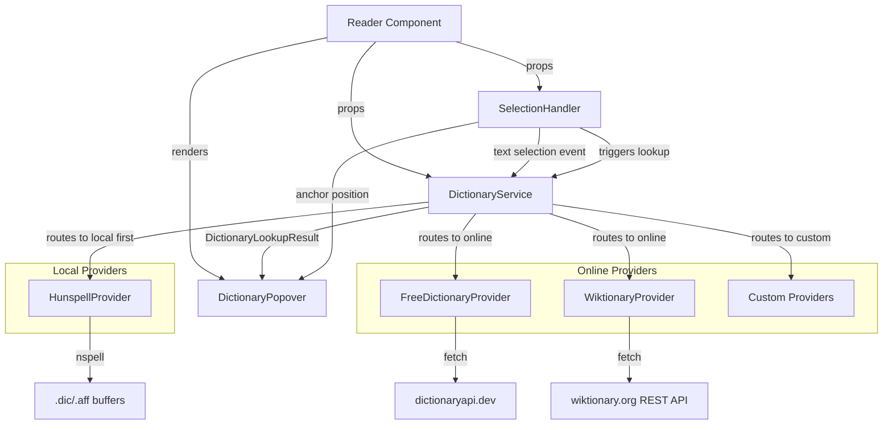
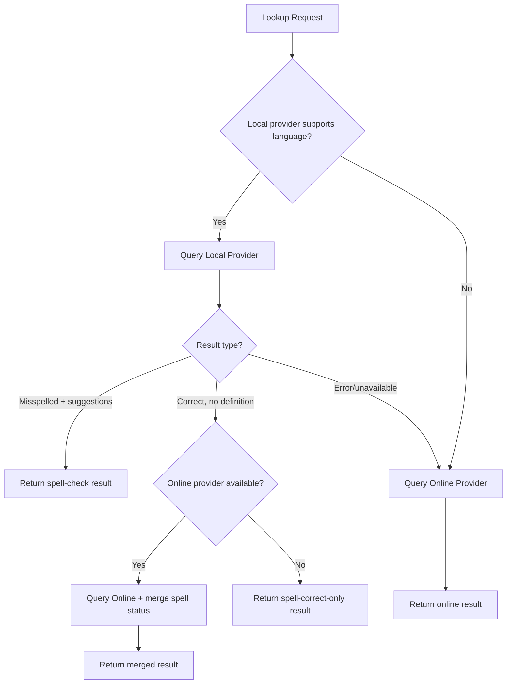
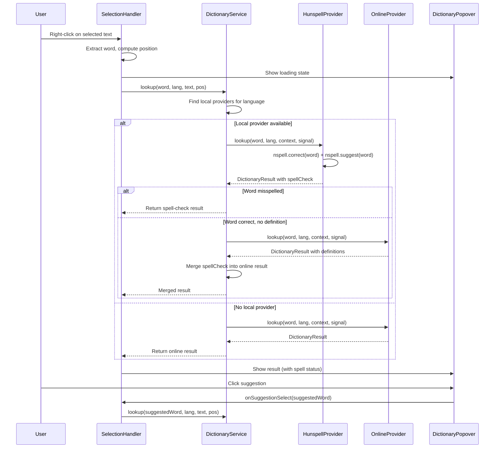

# Design Document: Language Dictionaries

## Overview

This design extends the existing Qari dictionary infrastructure to provide built-in language dictionary providers (online and local/offline) and a complete text-selection-to-definition flow. The system integrates two open REST APIs (Free Dictionary API, Wiktionary REST API), adds offline Hunspell-based spell checking via `nspell`, enhances the existing `DictionaryPopover` with loading/error/spell-check states, and adds a `SelectionHandler` that bridges user text interactions with dictionary lookups.

The architecture follows a **local-first priority** model: when both local (Hunspell) and online providers are registered, local providers are queried first for faster lookups without network dependency. If the local provider confirms spelling but has no definition, the service merges results from online providers.

### Key Design Decisions

1. **Extend, don't replace** — The existing `DictionaryProvider` interface, `DictionaryService`, and `DictionaryPopover` already have the right abstractions. New providers implement the existing interface.
2. **Local-first priority** — `DictionaryService` categorizes providers as "local" vs "online" and always checks local providers first. This gives instant offline results when Hunspell dictionaries are loaded.
3. **nspell for Hunspell support** — Uses the `nspell` npm package (Hunspell-compatible spell-checker in JS) to load `.dic`/`.aff` files. It accepts `Buffer` or `string` inputs and provides `correct()` and `suggest()` methods.
4. **Selection via context menu** — Dictionary lookup triggers on right-click (desktop) or long-press (touch), not on bare text selection. This avoids accidental popups during normal reading.
5. **AbortController for cancellation** — Network requests use `AbortController` to support cancellation when a new lookup supersedes an in-progress one.
6. **HTML stripping in Wiktionary provider** — Wiktionary returns HTML-embedded definitions. A simple regex-based strip function handles this at the provider level.
7. **Spell-check result merging** — When Hunspell confirms spelling but has no semantic definition, the service fetches from online providers and merges the spell-check status into the result.

## Architecture

### High-Level Architecture Diagram



### High-Level Flow

1. User selects text and right-clicks (desktop) or long-presses (touch)
2. `SelectionHandler` extracts the selected word, determines position, and provides anchor coordinates
3. `DictionaryService.lookup()` is called — routes to local providers first, then online
4. If a local provider (Hunspell) returns a spell-check result:
   - If word is misspelled → return immediately with suggestions
   - If word is correct but no definition → merge with online provider result
5. Provider returns `DictionaryResult` (or spell-check-enriched result)
6. `DictionaryPopover` displays the result (with spell-check status, definitions, or loading/error state)

### Provider Priority Resolution



### Integration with Existing Architecture

- `Reader` component already accepts `dictionaryProviders` prop and instantiates `DictionaryService`
- New `enableBuiltInDictionary` prop triggers automatic registration of built-in online providers
- New `hunspellDictionaries` prop triggers instantiation of `HunspellProvider` instances
- Registration order: Hunspell providers → user-supplied providers → built-in online providers
- `SelectionHandler` is a new hook (`useSelectionHandler`) used inside `Reader`
- `DictionaryPopover` gains loading, spell-check display, and suggestion interaction states

## Components and Interfaces

### New Components

#### `HunspellProvider` (class)
- **Location**: `src/services/hunspell-provider.ts`
- **Implements**: `DictionaryProvider`
- **Category**: `"local"`
- **Responsibility**: Loads Hunspell `.dic`/`.aff` files via `nspell`, provides spell checking (`correct`/`suggest`) and wraps results in `DictionaryResult` format
- **Configuration**: Language code, dictionary data (buffers or URLs)
- **Dependencies**: `nspell` npm package

#### `FreeDictionaryProvider` (class)
- **Location**: `src/services/free-dictionary-provider.ts`
- **Implements**: `DictionaryProvider`
- **Category**: `"online"`
- **Responsibility**: Fetches definitions from `https://api.dictionaryapi.dev/api/v2/entries/{lang}/{word}`
- **Configuration**: 5000ms timeout, supports `["en"]`

#### `WiktionaryProvider` (class)
- **Location**: `src/services/wiktionary-provider.ts`
- **Implements**: `DictionaryProvider`
- **Category**: `"online"`
- **Responsibility**: Fetches definitions from `https://{lang}.wiktionary.org/api/rest_v1/page/definition/{word}`
- **Configuration**: 5000ms timeout, configurable language list

#### `useSelectionHandler` (hook)
- **Location**: `src/hooks/useSelectionHandler.ts`
- **Responsibility**: Listens for contextmenu (right-click) and long-press events on the reader content area. Extracts the selected word, computes anchor position, and triggers lookup.
- **Returns**: `{ anchorPosition, lookupState, triggerLookup, dismiss }`

#### `stripHtmlTags` (utility)
- **Location**: `src/utils/strip-html.ts`
- **Responsibility**: Removes HTML tags from Wiktionary definition strings

### Modified Components

#### `DictionaryPopover` (enhanced)
- Add `loading` prop to show a loading spinner/skeleton
- Add `spellCheckResult` display: checkmark for correct, warning + suggestions for misspelled
- Add suggestion click handler to trigger new lookup
- Add focus trapping and keyboard dismiss (Escape)
- Add `aria-label` dynamically based on looked-up word
- Add accessible suggestions list with `aria-label="Spelling suggestions"`

#### `Reader` (enhanced)
- Add `enableBuiltInDictionary` boolean prop
- Add `hunspellDictionaries` prop for Hunspell dictionary configurations
- Integrate `useSelectionHandler` hook
- Register providers in priority order: Hunspell → custom → built-in online

#### `DictionaryService` (enhanced)
- Add `providerCategory` map to track "local" vs "online" classification
- Add `registerProvider(provider, category)` overload accepting category
- Add local-first lookup routing: query local providers first, fall through to online
- Add result merging: merge spell-check status with online definition when applicable
- Add `cancelCurrentLookup()` method using `AbortController`
- Pass `AbortSignal` to providers via an optional parameter
- Add `isProviderReady(providerId)` method for checking loading state

### Interface Extensions

```typescript
// Extended DictionaryProvider interface (backwards compatible)
export interface DictionaryProvider {
  id: string;
  supportedLanguages: string[];
  /** Provider category for priority routing */
  category?: 'local' | 'online';
  /** Whether the provider is ready to handle lookups */
  ready?: boolean;
  lookup(word: string, language: string, context: string, signal?: AbortSignal): Promise<DictionaryResult>;
}

// Extended DictionaryResult with spell-check info
export interface DictionaryResult {
  word: string;
  language: string;
  definitions: Definition[];
  notFound?: boolean;
  /** Spell-check result from local providers */
  spellCheck?: SpellCheckResult;
}

export interface SpellCheckResult {
  /** Whether the word is correctly spelled */
  correct: boolean;
  /** Suggested corrections for misspelled words (max 10) */
  suggestions: string[];
}

export interface Definition {
  meaning: string;
  partOfSpeech?: string;
  examples?: string[];
}
```

The `signal` parameter and `category`/`ready` fields are optional, maintaining backward compatibility with existing custom providers.

### Hunspell Dictionary Configuration Props

```typescript
export interface HunspellDictionaryConfig {
  /** ISO 639-1 language code this dictionary supports */
  language: string;
  /** Pre-loaded .aff file content (mutually exclusive with affUrl) */
  aff?: ArrayBuffer | Uint8Array;
  /** Pre-loaded .dic file content (mutually exclusive with dicUrl) */
  dic?: ArrayBuffer | Uint8Array;
  /** URL to fetch the .aff file from (mutually exclusive with aff) */
  affUrl?: string;
  /** URL to fetch the .dic file from (mutually exclusive with dic) */
  dicUrl?: string;
}

// Added to ReaderProps
export interface ReaderProps {
  // ... existing props ...
  hunspellDictionaries?: HunspellDictionaryConfig[];
  enableBuiltInDictionary?: boolean;
}
```

### Component Interaction Diagram



## Data Models

### HunspellProvider Internal State

```typescript
/** Internal state for the HunspellProvider */
interface HunspellProviderState {
  /** The nspell instance after initialization */
  speller: NSpell | null;
  /** Whether dictionary files have been loaded and nspell is ready */
  ready: boolean;
  /** Error encountered during initialization, if any */
  initError: Error | null;
}

/** nspell constructor signatures (from @types/nspell) */
interface NSpell {
  correct(word: string): boolean;
  suggest(word: string): string[];
  spell(word: string): { correct: boolean; forbidden: boolean; warn: boolean };
  add(word: string, model?: string): NSpell;
  remove(word: string): NSpell;
  wordCharacters(): string | undefined;
  dictionary(dic: Buffer | string): NSpell;
  personal(dic: Buffer | string): NSpell;
}
```

### Free Dictionary API Response Shape

```typescript
// Response from https://api.dictionaryapi.dev/api/v2/entries/{lang}/{word}
interface FreeDictionaryApiEntry {
  word: string;
  phonetic?: string;
  phonetics?: Array<{ text?: string; audio?: string }>;
  meanings: Array<{
    partOfSpeech: string;
    definitions: Array<{
      definition: string;
      example?: string;
      synonyms?: string[];
      antonyms?: string[];
    }>;
  }>;
}

// The API returns FreeDictionaryApiEntry[] (array of entries)
```

### Wiktionary REST API Response Shape

```typescript
// Response from https://{lang}.wiktionary.org/api/rest_v1/page/definition/{word}
interface WiktionaryDefinitionResponse {
  [languageCode: string]: Array<{
    partOfSpeech: string;
    language: string;
    definitions: Array<{
      definition: string; // may contain HTML tags
      parsedExamples?: Array<{ example: string }>;
      examples?: string[];
    }>;
  }>;
}
```

### Internal State Model

```typescript
/** State managed by useSelectionHandler */
interface SelectionLookupState {
  status: 'idle' | 'loading' | 'success' | 'error' | 'not-found';
  result: DictionaryLookupResult | null;
  anchorPosition: { top: number; left: number } | null;
  error?: string;
}
```

### DictionaryService Internal Provider Registry

```typescript
/** Internal provider entry with category metadata */
interface ProviderEntry {
  provider: DictionaryProvider;
  category: 'local' | 'online';
}

/** Extended lookup result with fallback and spell-check */
export interface DictionaryLookupResult extends DictionaryResult {
  fallbackLanguage?: string;
}
```

### Provider Configuration Types

```typescript
interface FreeDictionaryProviderConfig {
  timeout?: number; // default: 5000ms
}

interface WiktionaryProviderConfig {
  languages: string[]; // ISO 639-1 codes
  timeout?: number;    // default: 5000ms
}

interface HunspellProviderConfig {
  language: string;    // ISO 639-1 code
  aff: Buffer | string | ArrayBuffer | Uint8Array;
  dic: Buffer | string | ArrayBuffer | Uint8Array;
}
```

### Built-in Provider Defaults

When `enableBuiltInDictionary` is `true`, the following online providers are registered (after any local/custom providers):
1. `FreeDictionaryProvider` — supports `["en"]`
2. `WiktionaryProvider` — supports `["en", "fr", "es", "de", "it", "pt", "ru"]`

When `hunspellDictionaries` are provided, each config produces a `HunspellProvider` registered as `"local"` category, always before online providers.

**Final registration order**: Hunspell providers → user `dictionaryProviders` → built-in online providers.

## Correctness Properties

*A property is a characteristic or behavior that should hold true across all valid executions of a system — essentially, a formal statement about what the system should do. Properties serve as the bridge between human-readable specifications and machine-verifiable correctness guarantees.*

### Property 1: Word extraction position correctness

*For any* text body and any valid word position within it, extracting the word at that position SHALL return a non-empty string that exactly matches the characters at that position in the text, and the reported character offset SHALL point to the start of that word in the chapter text.

**Validates: Requirements 1.1, 1.4**

### Property 2: Multi-word selection yields first token

*For any* string containing two or more whitespace-separated words, the word extraction function SHALL return only the first whitespace-delimited token.

**Validates: Requirements 1.2**

### Property 3: Whitespace-only selection rejection

*For any* string composed entirely of whitespace characters (spaces, tabs, newlines, or empty string), the selection handler SHALL indicate that no lookup should be triggered (returns null/undefined).

**Validates: Requirements 1.3**

### Property 4: Popover renders all DictionaryResult fields

*For any* valid DictionaryResult with at least one definition, the rendered popover output SHALL contain the word, the language, and every definition's meaning. For each definition that includes a partOfSpeech, that value SHALL appear in the output. For each definition that includes examples, those example strings SHALL appear in the output.

**Validates: Requirements 2.2**

### Property 5: Provider registration order and priority

*For any* combination of Hunspell dictionary configs, user-supplied providers, and built-in flag, the DictionaryService SHALL register providers in the order: Hunspell providers first, then user-supplied providers, then built-in online providers. When multiple providers support the same language, lookups SHALL always be routed to the first provider in registration order that supports the requested language.

**Validates: Requirements 3.2, 3.4, 7.4, 7.5, 10.3**

### Property 6: Local-first provider routing

*For any* lookup request where both a local provider and an online provider support the requested language, the DictionaryService SHALL query the local provider first. If the local provider returns a successful result (misspelled with suggestions, or word found), the online provider SHALL NOT be queried. If no local provider supports the language, online providers SHALL be queried directly.

**Validates: Requirements 8.2, 8.3, 8.5**

### Property 7: Spell-check merges with online definitions

*For any* lookup where a local provider indicates the word is correctly spelled but provides no semantic definition, AND an online provider supports the same language, the DictionaryService SHALL query the online provider and the final result SHALL contain both the `spellCheck.correct = true` status from the local provider AND the definitions from the online provider.

**Validates: Requirements 8.4**

### Property 8: FreeDictionary API response mapping preserves content

*For any* valid FreeDictionary API response containing meanings with definitions, the mapping function SHALL produce a DictionaryResult where every meaning's partOfSpeech is preserved, every definition text appears as a Definition.meaning, and every example sentence appears in the corresponding Definition.examples array.

**Validates: Requirements 4.3**

### Property 9: Wiktionary URL construction

*For any* language code and any word string, the Wiktionary provider SHALL construct the request URL as `https://{language}.wiktionary.org/api/rest_v1/page/definition/{encodedWord}` where `{encodedWord}` is the URI-encoded word.

**Validates: Requirements 5.3**

### Property 10: Wiktionary API response mapping preserves content

*For any* valid Wiktionary REST API response containing definition entries, the mapping function SHALL produce a DictionaryResult where every definition's text content (after HTML stripping) appears as a Definition.meaning, every partOfSpeech is preserved, and every example sentence is included.

**Validates: Requirements 5.4**

### Property 11: HTML tag stripping is correct and idempotent

*For any* string containing HTML tags, the strip function SHALL remove all HTML tags (content between `<` and `>` that forms valid tag syntax) and SHALL preserve all text content that is not part of a tag. Applying the strip function twice SHALL produce the same result as applying it once (idempotence).

**Validates: Requirements 5.8**

### Property 12: Hunspell correct words return valid result

*For any* word that the nspell instance reports as correctly spelled, the HunspellProvider SHALL return a DictionaryResult with `notFound` set to false and a `spellCheck` field with `correct: true` and an empty `suggestions` array.

**Validates: Requirements 6.10, 9.2**

### Property 13: Hunspell misspelled words return capped suggestions

*For any* word that the nspell instance reports as incorrectly spelled, the HunspellProvider SHALL return a DictionaryResult with `spellCheck.correct` set to false and `spellCheck.suggestions` containing at most 10 entries from nspell's suggest output.

**Validates: Requirements 6.9, 9.3**

### Property 14: Spell-check UI display and accessibility

*For any* DictionaryResult containing a `spellCheck` field, the DictionaryPopover SHALL display a checkmark icon when `correct` is true, and a warning icon with a list of suggestions when `correct` is false. When suggestions are present, they SHALL be rendered as an accessible list with `aria-label="Spelling suggestions"`.

**Validates: Requirements 2.6, 9.4, 13.5**

### Property 15: Superseded lookup cancellation

*For any* sequence of two or more lookup requests made in rapid succession, all lookups except the most recent SHALL be cancelled (their AbortSignal aborted), and only the result of the final lookup SHALL be presented to the user.

**Validates: Requirements 12.5**

### Property 16: Accessible aria-label contains looked-up word

*For any* non-empty word passed to the DictionaryPopover, the rendered element's `aria-label` attribute SHALL contain that word string.

**Validates: Requirements 13.3**

## Error Handling

### Network Errors

| Scenario | Handler | Behavior |
|----------|---------|----------|
| API returns 404 | Provider | Returns `{ notFound: true }` — popover shows "not found" |
| Network timeout (5s) | Provider | Throws error — DictionaryService catches and returns error result |
| Network unreachable | Provider | Throws error — DictionaryService catches and returns error result |
| AbortController abort | Provider | Throws `AbortError` — silently ignored (expected cancellation) |
| Invalid JSON response | Provider | Throws parse error — DictionaryService catches and returns error result |
| Hunspell .dic/.aff fetch fails | HunspellProvider | Throws during initialization — reported via `onError` callback |
| Hunspell invalid/corrupt data | HunspellProvider | Throws during initialization with descriptive message |

### State Recovery

- **Cancelled requests**: When a lookup is superseded, the `AbortError` is caught and discarded. No UI update occurs for cancelled requests.
- **Multiple rapid lookups**: Only the latest lookup's result is applied to state. Race conditions are prevented by comparing a request ID.
- **Provider throws unexpectedly**: The existing `DictionaryService.lookup()` catch block produces a user-friendly "lookup failed" message.
- **Hunspell loading state**: While `HunspellProvider` is fetching dictionary files from URLs, it reports `ready: false`. The service marks it as unavailable and falls through to online providers until loading completes.

### Graceful Degradation

- If `enableBuiltInDictionary` is true but the network is unavailable, online lookups fail gracefully with error messages in the popover. Hunspell (if loaded from buffers) continues to work offline.
- If Hunspell dictionary files fail to load, the provider is marked as failed and removed from the active provider list. Online providers still function normally.
- If a provider's API changes its response format, the mapping will produce empty definitions rather than crashing. The result will show "not found" semantics.
- If no provider supports the book's language, the existing fallback language mechanism in `DictionaryService` offers an alternative.
- If nspell throws during `correct()` or `suggest()` for a particular word (e.g., extremely long input), the HunspellProvider catches the error and returns a "lookup failed" result rather than crashing.

## Testing Strategy

### Unit Tests (Example-Based)

Unit tests cover specific scenarios, edge cases, and integration points:

- **DictionaryPopover states**: loading, success, error, not-found, spell-check rendering
- **Spell-check suggestion interaction**: clicking suggestion triggers new lookup
- **Keyboard dismiss**: Escape closes popover and restores focus
- **Focus trapping**: Tab cycles within popover
- **Context menu integration**: right-click with/without selection
- **Long-press detection**: touch event sequence triggers lookup
- **Provider registration**: enableBuiltInDictionary and hunspellDictionaries behavior
- **HunspellProvider initialization**: buffer vs URL loading, error cases
- **HunspellProvider unavailable during loading**: falls through to online
- **404 handling**: all providers return notFound on 404
- **Timeout handling**: all providers throw on timeout
- **No providers registered**: selection handler does not intercept events

### Property-Based Tests (fast-check)

Property tests verify universal correctness across generated inputs. The project uses `fast-check` v3.15.1 (already a devDependency) with Vitest.

**Configuration**: Minimum 100 iterations per property test.

**Tag format**: `Feature: language-dictionaries, Property {N}: {title}`

| Property | Test File | What's Generated |
|----------|-----------|-----------------|
| 1: Word extraction | `src/hooks/__tests__/word-extraction.property.test.ts` | Random text bodies, word positions |
| 2: Multi-word first token | `src/hooks/__tests__/word-extraction.property.test.ts` | Random multi-word strings |
| 3: Whitespace rejection | `src/hooks/__tests__/word-extraction.property.test.ts` | Whitespace-only strings |
| 4: Popover field rendering | `src/components/__tests__/popover-fields.property.test.ts` | Random DictionaryResult objects |
| 5: Provider ordering | `src/services/__tests__/provider-ordering.property.test.ts` | Random provider arrays with category combinations |
| 6: Local-first routing | `src/services/__tests__/local-first-routing.property.test.ts` | Random local+online provider sets |
| 7: Spell-check merge | `src/services/__tests__/spellcheck-merge.property.test.ts` | Random correct-word scenarios with online definitions |
| 8: FreeDictionary mapping | `src/services/__tests__/free-dictionary-mapping.property.test.ts` | Random valid API response shapes |
| 9: Wiktionary URL | `src/services/__tests__/wiktionary-url.property.test.ts` | Random language codes and words |
| 10: Wiktionary mapping | `src/services/__tests__/wiktionary-mapping.property.test.ts` | Random valid Wiktionary response shapes |
| 11: HTML stripping | `src/utils/__tests__/strip-html.property.test.ts` | Random strings with HTML tags |
| 12: Hunspell correct words | `src/services/__tests__/hunspell-correct.property.test.ts` | Random words mocked as correct |
| 13: Hunspell misspelled | `src/services/__tests__/hunspell-misspelled.property.test.ts` | Random words with varying suggestion counts |
| 14: Spell-check UI | `src/components/__tests__/popover-spellcheck.property.test.ts` | Random SpellCheckResult objects |
| 15: Lookup cancellation | `src/services/__tests__/lookup-cancellation.property.test.ts` | Random sequences of lookup calls |
| 16: Accessible label | `src/components/__tests__/popover-accessibility.property.test.ts` | Random word strings |

### Integration Tests

- End-to-end flow: select word → right-click → popover appears with definition (mocked fetch)
- HunspellProvider with real small `.dic`/`.aff` files for integration verification
- Local-first flow: Hunspell returns spell result, online provides definition, merged display
- Built-in provider with mocked API responses
- Provider fallback chain when first provider doesn't support a language

### Test Library

- **Framework**: Vitest (already configured)
- **Property testing**: fast-check v3.15.1 (already a devDependency)
- **DOM testing**: @testing-library/react (already a devDependency)
- **Mocking**: Vitest's built-in `vi.fn()` and `vi.mock()` for fetch and nspell mocking
- **New dependency for implementation**: `nspell` (runtime), `@types/nspell` (dev)
