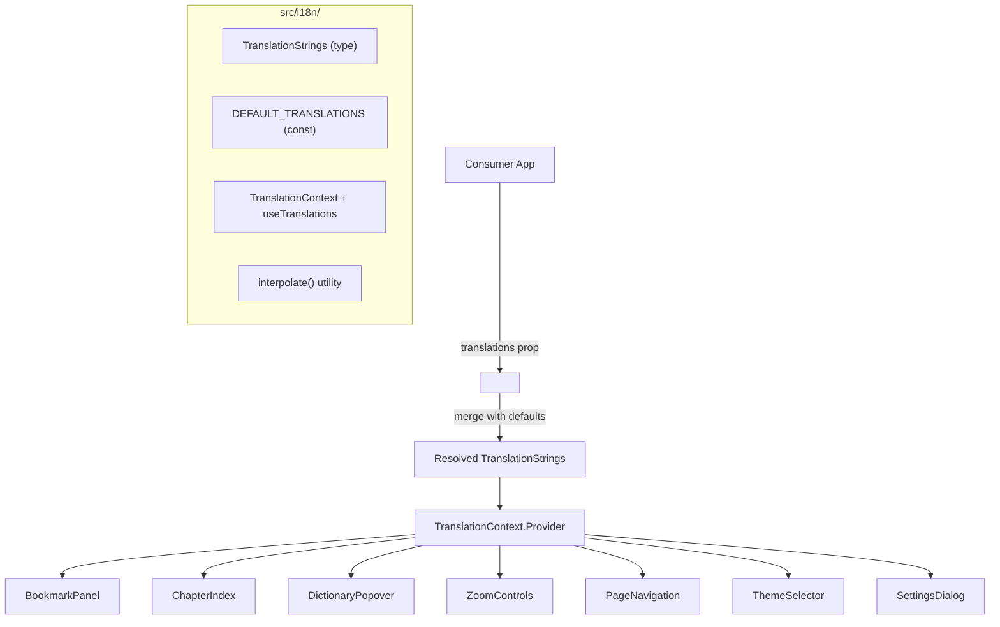

# Design Document: UI Translations

## Overview

This design introduces an internationalization (i18n) layer for the Qari ebook reader. The system allows consumers to pass a `translations` prop on the `<Reader />` component, which propagates localized UI strings to all sub-components via a dedicated React context. A complete English default ensures backward compatibility.

The design follows the same context-based architecture already used in the project (`ReaderContext` pattern) and introduces a minimal, focused `TranslationContext` that is lightweight and independent from the reader state context.

### Design Decisions

1. **Separate context vs. extending ReaderContext**: A dedicated `TranslationContext` is introduced rather than adding translations to `ReaderContextValue`. This keeps the translation concern isolated, avoids unnecessary re-renders when only translations change, and makes the `useTranslations` hook reusable outside the Reader tree if needed in the future.

2. **Shallow merge strategy**: `Partial<TranslationStrings>` is merged with `DEFAULT_TRANSLATIONS` using a single-level spread. This keeps the API simple — there are no nested objects in the translation type — and makes the merge operation cheap and predictable.

3. **Token interpolation**: A standalone `interpolate()` utility handles `{token}` replacement. This is a pure function, easily testable, and avoids pulling in a full i18n library (ICU MessageFormat, etc.) for what is a simple token substitution use case.

## Architecture



The `TranslationContext.Provider` is nested inside `ReaderContext.Provider` in the Reader's render tree. Sub-components call `useTranslations()` to get the resolved translation object, then use `interpolate()` for any strings containing `{token}` placeholders.

## Components and Interfaces

### TranslationStrings Type

```typescript
// src/i18n/types.ts

export interface TranslationStrings {
  // Reader component
  loading: string;
  errorSource: string;
  errorFormat: string;
  tableOfContents: string;
  bookmarks: string;
  readingSettings: string;
  enterFullscreen: string;
  exitFullscreen: string;
  previousPage: string;
  nextPage: string;
  pageIndicator: string; // supports {current}, {total}, {percent}
  resetToDefaults: string;

  // Settings dialog
  settingsTheme: string;
  themeLight: string;
  themeDark: string;
  themeSepia: string;
  themeHighContrast: string;
  settingsFontFamily: string;
  settingsFontSize: string; // supports {size}
  settingsJustify: string;
  settingsLineSpacing: string; // supports {value}
  settingsLetterSpacing: string; // supports {value}
  settingsWordSpacing: string; // supports {value}
  settingsMargin: string; // supports {value}
  settingsColumns: string;

  // Dictionary popover
  dictionaryLoading: string;
  dictionaryClose: string;
  dictionaryNotFound: string; // supports {word}
  dictionaryNoDictionary: string;
  dictionaryTryIn: string; // supports {language}
  spellcheckCorrect: string;
  spellcheckMisspelled: string;
  spellingSuggestions: string;
  dictionaryLoadingAriaLabel: string;
  dictionaryExamples: string;

  // Bookmark panel
  bookmarksPanelTitle: string;
  bookmarkNamePlaceholder: string;
  bookmarkAdd: string;
  bookmarksEmpty: string;
  bookmarkRename: string;
  bookmarkDelete: string;
  bookmarkSave: string;
  bookmarkCancel: string;
  bookmarkNewNameAriaLabel: string;
  bookmarkCreateAriaLabel: string;

  // Chapter index
  chaptersTitle: string;
  goToChapter: string; // supports {title}

  // Zoom controls
  zoomControls: string;
  zoomIn: string; // supports {level}
  zoomOut: string; // supports {level}
}
```

### DEFAULT_TRANSLATIONS Constant

```typescript
// src/i18n/defaults.ts

import type { TranslationStrings } from './types';

export const DEFAULT_TRANSLATIONS: TranslationStrings = {
  // Reader
  loading: 'Loading...',
  errorSource: 'Source:',
  errorFormat: 'Format:',
  tableOfContents: 'Table of contents',
  bookmarks: 'Bookmarks',
  readingSettings: 'Reading settings',
  enterFullscreen: 'Enter fullscreen',
  exitFullscreen: 'Exit fullscreen',
  previousPage: 'Previous page',
  nextPage: 'Next page',
  pageIndicator: 'Page {current}/{total}',
  resetToDefaults: 'Reset to Defaults',

  // Settings dialog
  settingsTheme: 'Theme',
  themeLight: 'Light',
  themeDark: 'Dark',
  themeSepia: 'Sepia',
  themeHighContrast: 'HC',
  settingsFontFamily: 'Font Family',
  settingsFontSize: 'Font Size',
  settingsJustify: 'Justify Text',
  settingsLineSpacing: 'Line Spacing',
  settingsLetterSpacing: 'Letter Spacing',
  settingsWordSpacing: 'Word Spacing',
  settingsMargin: 'Margin',
  settingsColumns: 'Columns',

  // Dictionary popover
  dictionaryLoading: 'Loading...',
  dictionaryClose: 'Close dictionary',
  dictionaryNotFound: 'No definition found for "{word}".',
  dictionaryNoDictionary: 'No dictionary available for this language.',
  dictionaryTryIn: 'Try in {language}',
  spellcheckCorrect: 'Correctly spelled',
  spellcheckMisspelled: 'Misspelled',
  spellingSuggestions: 'Spelling suggestions',
  dictionaryLoadingAriaLabel: 'Dictionary lookup loading',
  dictionaryExamples: 'Examples',

  // Bookmark panel
  bookmarksPanelTitle: 'Bookmarks',
  bookmarkNamePlaceholder: 'Bookmark name',
  bookmarkAdd: 'Add Bookmark',
  bookmarksEmpty: 'No bookmarks yet.',
  bookmarkRename: 'Rename',
  bookmarkDelete: 'Delete',
  bookmarkSave: 'Save',
  bookmarkCancel: 'Cancel',
  bookmarkNewNameAriaLabel: 'New bookmark name',
  bookmarkCreateAriaLabel: 'Create bookmark',

  // Chapter index
  chaptersTitle: 'Chapters',
  goToChapter: 'Go to chapter: {title}',

  // Zoom controls
  zoomControls: 'Zoom controls',
  zoomIn: 'Zoom in',
  zoomOut: 'Zoom out',
};
```

### TranslationContext and useTranslations Hook

```typescript
// src/i18n/context.ts

import { createContext, useContext } from 'react';
import type { TranslationStrings } from './types';
import { DEFAULT_TRANSLATIONS } from './defaults';

export const TranslationContext = createContext<TranslationStrings>(DEFAULT_TRANSLATIONS);

/**
 * Hook to access the resolved TranslationStrings from context.
 * Always returns a fully-resolved object (no undefined keys).
 */
export function useTranslations(): TranslationStrings {
  return useContext(TranslationContext);
}
```

### interpolate() Utility

```typescript
// src/i18n/interpolate.ts

/**
 * Replaces {token} placeholders in a template string with values from a params map.
 * Tokens with no corresponding value are left as-is in the output.
 *
 * @param template - The translation string with {token} placeholders
 * @param params - A record of token names to replacement values
 * @returns The interpolated string
 */
export function interpolate(
  template: string,
  params: Record<string, string | number>
): string {
  return template.replace(/\{(\w+)\}/g, (match, key: string) => {
    if (key in params) {
      return String(params[key]);
    }
    return match;
  });
}
```

### Module Index

```typescript
// src/i18n/index.ts

export type { TranslationStrings } from './types';
export { DEFAULT_TRANSLATIONS } from './defaults';
export { TranslationContext, useTranslations } from './context';
export { interpolate } from './interpolate';
```

## Data Models

### Translation Resolution Flow

1. **Input**: Consumer passes `translations?: Partial<TranslationStrings>` to `<Reader />`
2. **Merge**: Reader computes the resolved object:
   ```typescript
   const resolved: TranslationStrings = {
     ...DEFAULT_TRANSLATIONS,
     ...translations,
   };
   ```
3. **Memoization**: The resolved object is wrapped in `useMemo` keyed on the `translations` prop reference to avoid unnecessary context re-renders:
   ```typescript
   const resolvedTranslations = useMemo(
     () => ({ ...DEFAULT_TRANSLATIONS, ...translations }),
     [translations]
   );
   ```
4. **Provision**: The resolved object is set as the value of `TranslationContext.Provider`.
5. **Consumption**: Sub-components call `useTranslations()` to read the resolved object.
6. **Interpolation**: For dynamic strings, components call `interpolate(t.pageIndicator, { current: 1, total: 42, percent: 2 })`.

### Reader Render Tree (Updated)

```tsx
<ReaderContext.Provider value={contextValue}>
  <TranslationContext.Provider value={resolvedTranslations}>
    {/* ... existing reader UI tree ... */}
  </TranslationContext.Provider>
</ReaderContext.Provider>
```

### File Structure

```
src/
└── i18n/
    ├── index.ts          # barrel export
    ├── types.ts          # TranslationStrings interface
    ├── defaults.ts       # DEFAULT_TRANSLATIONS constant
    ├── context.ts        # TranslationContext + useTranslations hook
    └── interpolate.ts    # interpolate() utility function
```

### Sub-Component Integration Pattern

Each sub-component follows the same pattern:

```typescript
import { useTranslations, interpolate } from '../i18n';

export const SomeComponent: React.FC = () => {
  const t = useTranslations();

  return (
    <button aria-label={interpolate(t.goToChapter, { title: chapter.title })}>
      {t.chaptersTitle}
    </button>
  );
};
```

## Correctness Properties

*A property is a characteristic or behavior that should hold true across all valid executions of a system — essentially, a formal statement about what the system should do. Properties serve as the bridge between human-readable specifications and machine-verifiable correctness guarantees.*

### Property 1: Partial merge preserves provided keys and fills missing keys with defaults

*For any* subset of `TranslationStrings` keys with arbitrary non-empty string values, merging that partial object with `DEFAULT_TRANSLATIONS` SHALL produce a resolved object where: (a) every key present in the partial uses the partial's value, and (b) every key absent from the partial uses the corresponding `DEFAULT_TRANSLATIONS` value.

**Validates: Requirements 1.3**

### Property 2: Interpolation replaces all matched tokens

*For any* template string containing one or more `{tokenName}` placeholders and a params record that includes entries for those token names, `interpolate(template, params)` SHALL produce an output where every matched token is replaced with `String(params[tokenName])`.

**Validates: Requirements 9.1**

### Property 3: Interpolation preserves unmatched tokens

*For any* template string containing `{tokenName}` placeholders and a params record that does NOT contain an entry for a given token name, `interpolate(template, params)` SHALL leave that `{tokenName}` literally in the output string.

**Validates: Requirements 9.3**

## Error Handling

| Scenario | Behavior |
|----------|----------|
| `translations` prop is `undefined` | Use `DEFAULT_TRANSLATIONS` entirely (no merge needed) |
| `translations` prop is an empty object `{}` | Merge produces `DEFAULT_TRANSLATIONS` unchanged |
| `translations` prop contains keys with empty string values | Empty strings are treated as valid overrides — the consumer intentionally set them |
| `interpolate()` receives a template with no tokens | Returns the template unchanged (the regex has no matches) |
| `interpolate()` receives an empty params object | All tokens remain as-is in the output |
| `useTranslations()` called outside Provider | Returns `DEFAULT_TRANSLATIONS` (context default value), no error thrown |

The design intentionally avoids throwing errors for edge cases. A consumer providing partial or unusual translation values should never crash the reader.

## Testing Strategy

### Unit Tests (Example-Based)

Unit tests verify specific integration points — that each sub-component correctly reads from `TranslationContext` and renders the expected translated string:

- Render `<Reader>` without `translations` prop → all strings match `DEFAULT_TRANSLATIONS`
- Render `<Reader>` with partial translations → overridden keys appear, others use defaults
- Render `<BookmarkPanel>` within a custom `TranslationContext.Provider` → verify panel uses context strings
- Render `<DictionaryPopover>` in loading/notFound/noDictionary states → verify translated messages
- Render `<ChapterIndex>` with chapters → verify interpolated `goToChapter` aria-labels
- Render `<ZoomControls>` → verify custom zoom labels
- Render `<PageNavigation>` → verify interpolated page indicator
- Verify `DEFAULT_TRANSLATIONS` contains all keys (no undefined values)
- Verify `DEFAULT_TRANSLATIONS` matches current hardcoded English strings (backward compatibility)

### Property-Based Tests (fast-check)

Property tests use `fast-check` (already in the project) to verify universal correctness:

- **Property 1** (merge): Generate random `Partial<TranslationStrings>` objects (random subsets of keys with arbitrary string values). Assert the merge produces correct values for all keys.
  - Minimum 100 iterations
  - Tag: `Feature: ui-translations, Property 1: Partial merge preserves provided keys and fills missing keys with defaults`

- **Property 2** (interpolation replacement): Generate random template strings with `{token}` placeholders and matching params. Assert all matched tokens are replaced.
  - Minimum 100 iterations
  - Tag: `Feature: ui-translations, Property 2: Interpolation replaces all matched tokens`

- **Property 3** (interpolation preservation): Generate random template strings with `{token}` placeholders and incomplete params. Assert unmatched tokens remain literal.
  - Minimum 100 iterations
  - Tag: `Feature: ui-translations, Property 3: Interpolation preserves unmatched tokens`

### Testing Library

- **Property-based testing**: `fast-check` ^3.15.1 (already installed)
- **Test runner**: Vitest (already configured)
- **Component testing**: `@testing-library/react` (already installed)
