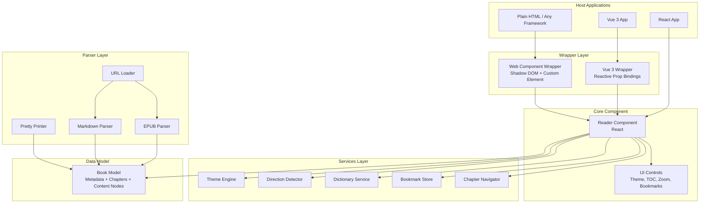
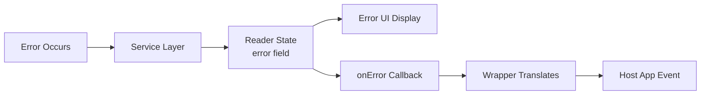

# Design Document: Universal Ebook Reader

## Overview

The Universal Ebook Reader is a framework-agnostic reading component built as a React core with wrapper layers for Vue 3 and Web Components. The system follows a layered architecture: a pure logic layer (parsers, models, services) sits beneath a React rendering layer, which is wrapped by framework adapters for cross-platform use.

Key architectural decisions:
- **React Core + Wrapper Pattern**: The Reader is built as a React component. Vue and Web Component wrappers mount/unmount this React component using framework-specific lifecycle hooks. This avoids duplicating UI logic.
- **Shadow DOM Encapsulation**: The Web Component wrapper uses Shadow DOM to isolate styles, ensuring no CSS leakage between the reader and host page.
- **Plugin-Based Dictionary**: Dictionary providers are registered via a simple interface, allowing language-specific dictionaries without coupling the core to any particular service.
- **Adapter-Based Storage**: Bookmark persistence uses a strategy pattern — local storage by default, swappable with a custom server adapter that conforms to a defined interface.
- **Round-Trip Parsers**: EPUB and Markdown parsers produce a shared internal `Book` model. A Pretty Printer serializes this model back to source format. This enables property-based round-trip verification.

## Architecture



### Layer Responsibilities

| Layer | Responsibility |
|-------|---------------|
| Wrapper Layer | Adapts React component to Vue/Web Component lifecycle; translates props and events |
| Core Component | Renders book content, manages reading state, orchestrates services |
| Services Layer | Stateful business logic — themes, direction, dictionary, bookmarks, navigation |
| Parser Layer | Transforms input formats into the internal Book model and back |
| Data Model | Shared internal representation used by all layers |

### Key Design Decisions

1. **Single Book Model**: All parsers (EPUB, Markdown) produce the same `Book` data structure. This unifies downstream rendering and enables format-agnostic features (bookmarks, navigation, themes).

2. **Service Injection**: Services are instantiated at the Reader level and passed down via React Context. This allows wrappers to pass configuration (e.g., custom bookmark adapter) as props that configure services.

3. **Event Bus for Wrappers**: The Reader emits state changes via a callback-based API. Wrappers translate these into framework-native events (Vue `emit`, Web Component `CustomEvent`).

4. **CSS Custom Properties for Theming**: The Theme Engine sets CSS custom properties on the reader root element. This works seamlessly inside Shadow DOM and allows themes to be applied without re-rendering content.

## Components and Interfaces

### Reader Component (React)

```typescript
interface ReaderProps {
  // Input source - one of these must be provided
  source: EpubSource | UrlSource | MarkdownSource;

  // Theme & display
  theme?: ThemeName;           // 'light' | 'dark' | 'sepia' | 'high-contrast'
  fontFamily?: FontFamily;     // 'serif' | 'sans-serif' | 'monospace' | 'nastaliq'
  fontSize?: number;           // 12-48, step 2
  zoom?: number;               // 50-300, step 10

  // Direction override
  direction?: 'ltr' | 'rtl' | 'auto';

  // Plugins
  dictionaryProviders?: DictionaryProvider[];
  bookmarkAdapter?: CustomStoreAdapter;

  // Callbacks
  onPageChange?: (event: PageChangeEvent) => void;
  onBookmarkCreate?: (event: BookmarkEvent) => void;
  onError?: (event: ReaderError) => void;
  onReady?: (event: BookLoadedEvent) => void;
}

type EpubSource = { type: 'epub'; data: ArrayBuffer | File };
type UrlSource = { type: 'url'; url: string };
type MarkdownSource = { type: 'markdown'; content: string | File };
```

### Vue 3 Wrapper

```typescript
// Vue component with reactive prop bindings
defineComponent({
  name: 'EbookReader',
  props: {
    source: { type: Object as PropType<ReaderProps['source']>, required: true },
    theme: { type: String as PropType<ThemeName>, default: 'light' },
    fontFamily: { type: String as PropType<FontFamily>, default: 'serif' },
    fontSize: { type: Number, default: 16 },
    zoom: { type: Number, default: 100 },
    direction: { type: String as PropType<'ltr' | 'rtl' | 'auto'>, default: 'auto' },
    dictionaryProviders: { type: Array as PropType<DictionaryProvider[]> },
    bookmarkAdapter: { type: Object as PropType<CustomStoreAdapter> },
  },
  emits: ['page-change', 'bookmark-create', 'error', 'ready'],
});
```

### Web Component Wrapper

```typescript
class EbookReaderElement extends HTMLElement {
  // Observed attributes map to Reader props
  static observedAttributes = ['theme', 'font-family', 'font-size', 'zoom', 'direction'];

  // JavaScript property API for complex values
  set source(value: ReaderProps['source']) { /* ... */ }
  set dictionaryProviders(value: DictionaryProvider[]) { /* ... */ }
  set bookmarkAdapter(value: CustomStoreAdapter) { /* ... */ }

  // Lifecycle: creates Shadow DOM, mounts React root
  connectedCallback(): void;
  disconnectedCallback(): void;
  attributeChangedCallback(name: string, oldVal: string, newVal: string): void;
}
```

### Dictionary Provider Interface

```typescript
interface DictionaryProvider {
  /** Unique identifier for this provider */
  id: string;
  /** Languages this provider supports (ISO 639-1 codes) */
  supportedLanguages: string[];
  /** Look up a word with context */
  lookup(word: string, language: string, context: string): Promise<DictionaryResult>;
}

interface DictionaryResult {
  word: string;
  language: string;
  definitions: Definition[];
  notFound?: boolean;
}

interface Definition {
  meaning: string;
  partOfSpeech?: string;
  examples?: string[];
}
```

### Custom Store Adapter Interface

```typescript
interface CustomStoreAdapter {
  save(bookmark: Bookmark): Promise<void>;
  load(bookId: string): Promise<Bookmark[]>;
  list(): Promise<Bookmark[]>;
  remove(bookmarkId: string): Promise<void>;
}
```

### Theme Engine Interface

```typescript
interface ThemeEngine {
  setTheme(theme: ThemeName): void;
  setFont(family: FontFamily): void;
  setFontSize(size: number): void;
  getPreferences(): ReadingPreferences;
  persistPreferences(): boolean; // returns false if storage unavailable
  loadPersistedPreferences(): ReadingPreferences | null;
}

type ThemeName = 'light' | 'dark' | 'sepia' | 'high-contrast';
type FontFamily = 'serif' | 'sans-serif' | 'monospace' | 'nastaliq';

interface ReadingPreferences {
  theme: ThemeName;
  fontFamily: FontFamily;
  fontSize: number; // 12-48
}

interface ThemeColors {
  background: string;
  foreground: string;
  accent: string;
  surface: string;
  border: string;
}
```

### Parser Interfaces

```typescript
interface EPUBParser {
  parse(data: ArrayBuffer): Promise<Book>;
}

interface MarkdownParser {
  parse(content: string): Book;
}

interface PrettyPrinter {
  toEpub(book: Book): ArrayBuffer;
  toMarkdown(book: Book): string;
}
```

### Direction Detector Interface

```typescript
interface DirectionDetector {
  detect(text: string): DirectionResult;
}

interface DirectionResult {
  direction: 'ltr' | 'rtl';
  confidence: 'high' | 'low'; // low when RTL% is 30-50%
  rtlPercentage: number;
  detectedScript?: string; // e.g., 'Arabic', 'Hebrew', 'Urdu'
}
```

## Data Models

### Book Model (Core Internal Representation)

```typescript
interface Book {
  metadata: BookMetadata;
  chapters: Chapter[];
}

interface BookMetadata {
  title: string;
  author?: string;
  language?: string;       // ISO 639-1
  publisher?: string;
  publicationDate?: string; // ISO 8601
  identifier?: string;     // ISBN or unique ID
}

interface Chapter {
  id: string;
  title: string;
  order: number;           // spine sequence position
  content: ContentNode[];
}

type ContentNode =
  | ParagraphNode
  | HeadingNode
  | ImageNode
  | CodeBlockNode
  | ListNode
  | OpaqueNode;           // For unsupported EPUB elements

interface ParagraphNode {
  type: 'paragraph';
  children: InlineNode[];
}

interface HeadingNode {
  type: 'heading';
  level: 1 | 2 | 3 | 4 | 5 | 6;
  children: InlineNode[];
}

interface ImageNode {
  type: 'image';
  src: string;
  alt?: string;
}

interface CodeBlockNode {
  type: 'code-block';
  language?: string;
  content: string;
}

interface ListNode {
  type: 'list';
  ordered: boolean;
  items: ListItem[];
}

interface ListItem {
  children: ContentNode[];
}

interface OpaqueNode {
  type: 'opaque';
  originalTag: string;
  rawContent: string;    // Preserved verbatim for round-trip
  attributes: Record<string, string>;
}

type InlineNode =
  | TextSpan
  | BoldSpan
  | ItalicSpan
  | LinkSpan
  | CodeSpan;

interface TextSpan {
  type: 'text';
  content: string;
}

interface BoldSpan {
  type: 'bold';
  children: InlineNode[];
}

interface ItalicSpan {
  type: 'italic';
  children: InlineNode[];
}

interface LinkSpan {
  type: 'link';
  href: string;
  children: InlineNode[];
}

interface CodeSpan {
  type: 'code';
  content: string;
}
```

### Bookmark Model

```typescript
interface Bookmark {
  id: string;              // UUID
  bookId: string;          // Identifies the book
  chapterId: string;       // Chapter within the book
  position: number;        // Character offset within chapter
  name: string;            // User-provided, 1-100 chars
  createdAt: string;       // ISO 8601 UTC
  updatedAt?: string;      // ISO 8601 UTC, set on rename
}
```

### Reader State

```typescript
interface ReaderState {
  book: Book | null;
  currentChapter: number;
  currentPage: number;
  totalPages: number;       // within current chapter
  readingProgress: number;  // 0-100, percentage of total book
  zoom: number;             // 50-300
  direction: 'ltr' | 'rtl';
  directionConfidence: 'high' | 'low';
  preferences: ReadingPreferences;
  bookmarks: Bookmark[];
  error: ReaderError | null;
  loading: boolean;
}
```

### Event Models

```typescript
interface PageChangeEvent {
  chapter: number;
  page: number;
  progress: number; // 0-100
}

interface BookmarkEvent {
  type: 'created' | 'renamed' | 'deleted';
  bookmark: Bookmark;
}

interface BookLoadedEvent {
  book: BookMetadata;
  chapterCount: number;
  direction: 'ltr' | 'rtl';
}

interface ReaderError {
  code: string;
  message: string;
  source?: string;      // input source name
  format?: string;      // detected format
  httpStatus?: number;  // for URL errors
}
```


## Correctness Properties

*A property is a characteristic or behavior that should hold true across all valid executions of a system — essentially, a formal statement about what the system should do. Properties serve as the bridge between human-readable specifications and machine-verifiable correctness guarantees.*

### Property 1: EPUB Round-Trip Preservation

*For any* valid Book representation, serializing it to EPUB via Pretty_Printer and parsing the result back via EPUB_Parser SHALL produce a Book that is structurally equal to the original — identical metadata, chapter count and ordering, content node types and textual content, and opaque nodes preserved verbatim (whitespace normalization between block elements is permitted).

**Validates: Requirements 2.6, 9.3, 9.5**

### Property 2: Markdown Round-Trip Preservation

*For any* valid Book representation that is expressible in Markdown (chapters mapped to H2 headings, content nodes limited to Markdown-compatible types), serializing it via Pretty_Printer to Markdown and parsing back via Markdown_Parser SHALL produce a Book with identical chapter count, chapter titles, content node types and text content in the same order, and metadata fields (excluding insignificant whitespace differences).

**Validates: Requirements 2.7, 10.1, 10.2, 10.3**

### Property 3: Direction Detection Threshold

*For any* text string of at least 1000 characters, the Direction_Detector SHALL classify it as RTL if more than 40% of the first 1000 characters are from RTL Unicode script ranges, as LTR if fewer than 30% are RTL, and as low-confidence (prompting user) if the RTL percentage is between 30% and 50%. Additionally, when Urdu script is detected, defaults SHALL be Nastaliq font with line spacing ≥ 2.0.

**Validates: Requirements 6.1, 6.7, 6.9**

### Property 4: Reading Preferences Round-Trip

*For any* valid combination of reading preferences (theme from the set {light, dark, sepia, high-contrast}, font family from {serif, sans-serif, monospace, nastaliq}, font size from 12–48 in 2px steps), persisting to local storage and loading back SHALL produce an identical preferences object.

**Validates: Requirements 3.6**

### Property 5: Zoom Level Clamping and Application

*For any* numeric zoom value, the Reader_Component SHALL clamp it to the range [50, 300] at the nearest 10% increment boundary. For values within range, the applied zoom SHALL equal the nearest valid increment. For values outside range, the applied zoom SHALL equal 50 or 300 respectively.

**Validates: Requirements 4.1, 4.5**

### Property 6: Display Changes Preserve Reading Position

*For any* reading position (chapter + character offset) and any display change (font family change, font size change, or zoom level change), the visible content after the change SHALL contain the same paragraph that was visible before the change.

**Validates: Requirements 3.4, 4.4**

### Property 7: Pinch-Zoom Gesture Snapping

*For any* pinch gesture magnitude that produces a raw zoom value, the final applied zoom level SHALL be the nearest 10% increment within the [50, 300] range.

**Validates: Requirements 4.3**

### Property 8: Sequential Page Navigation Invariant

*For any* book with multiple chapters and any valid reading position, the sequence of (next, previous) from any non-boundary page SHALL return to the original page. At chapter boundaries: last page + next = first page of next chapter, and first page + previous = last page of preceding chapter.

**Validates: Requirements 5.4, 5.5, 5.6**

### Property 9: Reading Progress Calculation

*For any* book and any character position within that book, the displayed reading progress SHALL equal round(characters_read / total_characters × 100), yielding an integer percentage from 0 to 100.

**Validates: Requirements 5.3**

### Property 10: Dictionary Context Extraction

*For any* word at any position within a text body, the context passed to the dictionary provider SHALL contain up to 200 characters before and up to 200 characters after the selected word, bounded by the text boundaries (no out-of-bounds access).

**Validates: Requirements 7.6**

### Property 11: Bookmark Data Integrity

*For any* bookmark creation with a valid name (1–100 characters), the resulting bookmark SHALL contain a non-empty bookId, correct chapterId, correct position offset, the provided name, and a valid UTC timestamp. *For any* rename attempt with an empty name or a name exceeding 100 characters, the operation SHALL be rejected and the bookmark SHALL remain unchanged.

**Validates: Requirements 8.1, 8.8**

### Property 12: Custom Adapter Delegation

*For any* sequence of bookmark operations (create, load, list, delete) when a Custom_Store_Adapter is configured, ALL operations SHALL be delegated to the adapter and NONE shall touch local storage.

**Validates: Requirements 8.3**

### Property 13: Adapter Timeout Fallback

*For any* Custom_Store_Adapter operation that does not resolve within 5 seconds or rejects with an error, the Bookmark_Store SHALL fall back to local storage for that operation and the operation SHALL still complete successfully (data persisted locally).

**Validates: Requirements 8.6**

### Property 14: Malformed Input Error Completeness

*For any* input that is unreadable or in an unsupported format, the resulting error SHALL contain: the input source name, the detected format (if determinable), and a specific failure reason string. No partial Book representation SHALL be produced.

**Validates: Requirements 2.4, 9.4**

### Property 15: Wrapper Behavioral Equivalence

*For any* valid set of configuration props, the Reader_Component rendered through the Vue wrapper or Web Component wrapper SHALL produce the same DOM structure and behavioral outcome as when the same props are passed directly in React, including after dynamic prop updates.

**Validates: Requirements 1.4**

### Property 16: Wrapper Event Propagation

*For any* state change event emitted by the Reader_Component (page navigation, bookmark creation, error), the wrapper layer SHALL propagate the event to the host application with the correct event payload — as a Vue emit event for the Vue wrapper and as a CustomEvent for the Web Component wrapper.

**Validates: Requirements 1.6**

## Error Handling

### Error Categories

| Category | Source | Handling Strategy |
|----------|--------|-------------------|
| Parse Error | EPUB_Parser, Markdown_Parser | Return structured error with reason; no partial Book. Display in Reader UI. |
| Network Error | URL_Loader | Timeout after 30s. Return HTTP status or network description. Display in Reader UI. |
| Storage Error | Bookmark_Store, Theme_Engine | Fall back to in-session state. Show notification. Continue operation. |
| Adapter Timeout | Custom_Store_Adapter | 5-second timeout. Fall back to local storage. Notify user of sync failure. |
| Validation Error | Bookmark_Store, Wrapper_Layer | Reject operation. Return specific validation message (field, constraint). |
| Dictionary Error | Dictionary_Service | Show "not found" or "no dictionary" message in popover. Offer fallback. |
| Prop Error | Wrapper_Layer | Emit error event with prop name and expected type. Do not render Reader. |

### Error Propagation Flow



### Graceful Degradation

- **Local storage unavailable**: Apply preferences in-session only, show notification
- **Custom adapter fails**: Fall back to local storage transparently
- **No dictionary for language**: Show message, offer fallback to default language
- **Low direction confidence**: Prompt user rather than guessing wrong
- **Unsupported EPUB elements**: Preserve as opaque nodes, render placeholder

## Testing Strategy

### Property-Based Testing

**Library**: [fast-check](https://github.com/dubzzz/fast-check) (TypeScript, integrates with Jest/Vitest)

**Configuration**: Minimum 100 iterations per property test.

**Tag format**: `Feature: universal-ebook-reader, Property {number}: {property_text}`

Property-based tests target the pure logic layer:

| Property | Target Module | Generator Strategy |
|----------|--------------|-------------------|
| 1: EPUB Round-Trip | EPUB_Parser + PrettyPrinter | Generate random Book instances with varied metadata, chapter counts, and content node combinations |
| 2: Markdown Round-Trip | Markdown_Parser + PrettyPrinter | Generate Book instances limited to Markdown-expressible content nodes |
| 3: Direction Detection | DirectionDetector | Generate text strings with controlled RTL character percentages |
| 4: Preferences Round-Trip | ThemeEngine | Generate random valid preference combinations |
| 5: Zoom Clamping | Reader zoom logic | Generate arbitrary numbers (negative, zero, huge) |
| 6: Position Preservation | Reader viewport logic | Generate reading positions + display change tuples |
| 7: Pinch Snap | Zoom gesture handler | Generate raw float zoom values from gesture magnitudes |
| 8: Navigation Invariant | ChapterNavigator | Generate book structures + position states |
| 9: Progress Calculation | ChapterNavigator | Generate books with known character counts + positions |
| 10: Context Extraction | DictionaryService | Generate text bodies + word positions |
| 11: Bookmark Integrity | BookmarkStore | Generate bookmark inputs (valid names, invalid names, boundary lengths) |
| 12: Adapter Delegation | BookmarkStore | Generate operation sequences with mock adapter |
| 13: Adapter Fallback | BookmarkStore | Generate timeout/rejection scenarios |
| 14: Error Completeness | Parsers | Generate random byte sequences and invalid inputs |
| 15: Wrapper Equivalence | Wrappers | Generate random prop configurations |
| 16: Event Propagation | Wrappers | Generate random event payloads |

### Unit Tests (Example-Based)

Unit tests cover specific scenarios, edge cases, and integration points:

- Theme color contrast ratios (WCAG AAA verification)
- Default values (theme: light, font: serif, size: 16px, zoom: 100%)
- Chapter navigation timing (< 200ms)
- Theme application timing (< 100ms)
- Shadow DOM existence on Web Component
- Specific EPUB file parsing (known inputs → known outputs)
- Bookmark CRUD operations
- Dictionary popover rendering with mock results
- No-chapter-structure edge case
- 50-bookmark limit enforcement

### Integration Tests

- URL_Loader with mocked HTTP responses (various content types, errors, timeouts)
- Dictionary provider registration and language-based routing
- Custom_Store_Adapter with mock server (success, failure, timeout paths)
- Vue wrapper lifecycle (mount, prop change, unmount)
- Web Component lifecycle (connectedCallback, attribute changes, disconnectedCallback)

### Visual/Manual Tests

- RTL layout with actual Urdu/Arabic content
- Nastaliq ligature rendering quality
- Mixed BiDi content
- Accessibility (screen reader, keyboard navigation, high-contrast theme)
- Pinch-zoom gesture on actual touch devices
